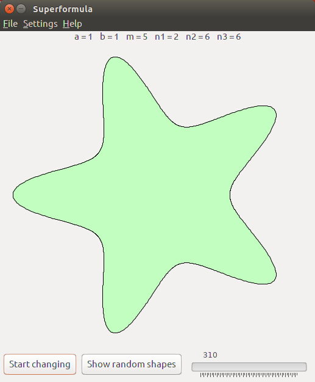

# superFormula
A viewer for shapers created from an ellipse-like formula

See https://en.wikipedia.org/wiki/Superformula

I learned about the superformula when reading an artical about how the worlds in the game No Man's Sky are generated.

## Screenshot

## License
Project is licensed under the [MIT license](LICENSE).
